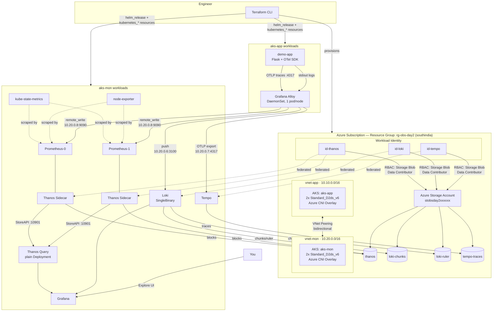
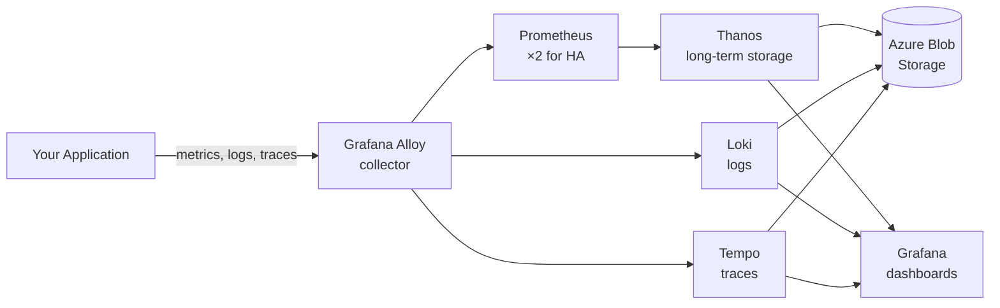

```mermaid
flowchart LR
    SA["Kubernetes ServiceAccount<br/>(e.g. monitoring/thanos)"] -->|signed OIDC token| Issuer["AKS OIDC Issuer"]
    Issuer -->|trust relationship| FIC["Federated Identity Credential<br/>subject: system:serviceaccount:monitoring:thanos"]
    FIC --> MI["Azure Managed Identity<br/>(id-thanos)"]
    MI -->|token exchange| AAD["Azure AD"]
    AAD -->|short-lived access token| RBAC["RBAC: Storage Blob<br/>Data Contributor<br/>scoped to ONE container"]
    RBAC --> Blob[(Blob Container)]
```

# Azure Observability

**A two-cluster AKS observability platform, built with Terraform, deployed with Helm, secured with Azure Workload Identity — with every real bug left in the story.**

> [!NOTE]
> This README documents what was actually built and debugged during this workshop. Where something wasn't implemented (CI/CD, automated tests), it's labeled **Future Work**, not glossed over.

---

## Table of Contents

1. [What This Is](#what-this-is)
2. [Architecture](#architecture)
3. [Technology Stack](#technology-stack)
4. [Prerequisites](#prerequisites)
5. [Repository Structure](#repository-structure)
6. [Deployment](#deployment)
7. [Design Deep Dives](#design-deep-dives)
8. [Validation](#validation)
9. [PromQL Reference](#promql-reference)
10. [Command Reference](#command-reference)
11. [Challenges and Troubleshooting](#challenges-and-troubleshooting)
12. [Cost and Cleanup](#cost-and-cleanup)
13. [CI/CD — Future Work](#cicd--future-work)
14. [Testing — Future Work](#testing--future-work)
15. [What You Will Learn](#what-you-will-learn)
16. [Interview Questions](#interview-questions)
17. [Future Improvements](#future-improvements)
18. [Portfolio Summary](#portfolio-summary)

---

## What This Is

Day 1 of this workshop ran a single Prometheus instance on a single Azure VM. It worked — and it had a single point of failure that was also the thing that would have told you about the failure.

Day 2 rebuilds this as a real platform: two AKS clusters, Prometheus running highly available, long-term metrics in Azure Blob Storage via Thanos, logs in Loki, traces in Tempo, all collected by Grafana Alloy from a real (small) application, all authenticated to Azure with **zero static credentials** — every component uses Azure Workload Identity instead of a storage key.

Everything here was provisioned with Terraform and deployed with Helm, and every configuration decision below is backed by something that actually happened during the build — including four separate Helm charts each hiding their configuration in a different, undocumented place, and one afternoon spent proving that a `#` is not a `//`.

---

## Architecture

### Full architecture



### Simplified view (for beginners)



### Workload identity flow (no passwords, anywhere)



> [!NOTE]
> **Generating a static PNG:** GitHub renders the Mermaid blocks above natively — no extra step needed to view them. If you want a portable image for a slide deck or LinkedIn post, export any block with the [Mermaid CLI](https://github.com/mermaid-js/mermaid-cli):
> ```bash
> npx @mermaid-js/mermaid-cli -i docs/architecture.mmd -o docs/day2-architecture.png
> ```
> This repository does not currently include a pre-rendered `docs/day2-architecture.png` — the Mermaid source above is the single source of truth.

---

## Technology Stack

| Layer | Technology | Purpose |
|---|---|---|
| IaC | Terraform (`azurerm`, `kubernetes`, `helm`, `random` providers) | Provisions Azure infra AND Kubernetes/Helm resources from one state file |
| Compute | Azure Kubernetes Service (AKS) ×2 | Application cluster + monitoring cluster |
| Networking | Azure VNet + Peering | Network isolation with an explicit, controlled path between clusters |
| Metrics | Prometheus (`kube-prometheus-stack`), 2 replicas | Scraping and short-term local storage |
| Long-term metrics | Thanos (Sidecar + Query) | Deduplication across HA replicas, long-term storage in Blob |
| Logs | Loki (SingleBinary mode) | Log aggregation, indexed by label |
| Traces | Tempo | Distributed tracing, indexed by trace ID only |
| Collection | Grafana Alloy (DaemonSet) | One agent, three signals, consistent labels |
| Visualization | Grafana | Unified query layer across Thanos, Loki, Tempo |
| Identity | Azure Workload Identity (OIDC federation) | Zero static credentials for any storage access |
| Object storage | Azure Blob Storage (4 containers) | Backing store for Thanos, Loki, Tempo |

---

## Prerequisites

- An Azure subscription. **Free Trial subscriptions have a hard 4 vCPU regional cap that blocks a two-cluster build** — see [Challenges](#challenges-and-troubleshooting). Pay-As-You-Go (with the free trial credit still applied) is recommended.
- `az` CLI, authenticated (`az login`)
- `terraform` >= 1.9
- `kubectl`
- `helm` (used for `helm show values` / `helm template` inspection during development; not required at deploy time since Terraform's `helm` provider drives the actual releases)
- A budget alert configured on the subscription before deploying anything (Cost Management + Billing → Budgets)

---

## Repository Structure

A single Terraform working directory, not a multi-module project — but split into one file per concern for readability, rather than one ~1350-line `main.tf`. File boundaries are purely organizational: Terraform reads every `.tf` file in the directory as one configuration regardless of which file a block lives in, so this split changes nothing about what gets built (verified with `terraform plan` showing zero diff against the pre-split version).

```
azure-observability-framework/
├── .gitignore            # Excludes *.tfstate, .terraform/, *.tfvars, .DS_Store
└── terraform/
    ├── providers.tf       # terraform{}, azurerm provider, and the default +
    │                      #   aliased kubernetes/helm provider pairs
    ├── network.tf         # Resource group, both VNets, both subnets, peering
    ├── clusters.tf        # Both azurerm_kubernetes_cluster resources
    ├── storage.tf         # Storage account + its 4 containers
    ├── identity.tf        # Workload identities, federated credentials,
    │                      #   per-container RBAC, the cluster's own
    │                      #   Network Contributor grant on vnet-mon
    ├── prometheus.tf      # kube-prometheus-stack + the Thanos sidecar's
    │                      #   ServiceAccount and object-storage Secret
    ├── thanos-query.tf    # Thanos Query — a plain Deployment/Service,
    │                      #   not a Helm chart (see Design Deep Dives)
    ├── grafana.tf         # Grafana admin Secret + helm_release
    ├── loki.tf            # Loki helm_release + its standalone internal
    │                      #   LoadBalancer Service
    ├── tempo.tf           # Tempo helm_release
    ├── alloy.tf           # aks-app's namespace, Alloy helm_release
    │                      #   (provider = helm.app), and its OTLP Service
    ├── demo-app.tf        # The Flask demo application
    ├── variables.tf       # Region, node size/count, CIDR ranges, tags
    ├── output.tf          # Cluster names, subnet IDs, OIDC issuer URLs,
    │                      #   identity client IDs, storage account name,
    │                      #   Grafana admin password (sensitive)
    ├── example.tfvars     # Copy to terraform.tfvars — the handful of
    │                      #   values worth reviewing before your first apply
    └── .terraform.lock.hcl   # Pinned provider versions
```

> [!NOTE]
> `terraform.tfstate` is **not** committed (it's in `.gitignore`) and is not part of this repository — it contains the storage account's resource IDs and the Grafana admin password in plaintext. Anyone cloning this repo runs `terraform init && terraform apply` against their own fresh state.

A `modules/`, `tests/`, or `docs/` split does not exist yet in this repository — see [Future Improvements](#future-improvements).

---

## Deployment

```bash
cd terraform
cp example.tfvars terraform.tfvars   # review location/node_size first — see
                                      #   Prerequisites and Challenges #1–2
                                      #   before assuming the defaults fit
                                      #   your subscription's quota
terraform init
terraform plan
terraform apply
```

> [!IMPORTANT]
> Every `kubectl ... --context aks-mon` / `--context aks-app` command in this README (and there are many, throughout Validation, Command Reference, and Challenges) depends on those two contexts existing in your local kubeconfig. Terraform's own `kubernetes`/`helm` providers **don't** need this step — they read cluster credentials directly from `azurerm_kubernetes_cluster.*.kube_config` — but *you*, running `kubectl` by hand afterward, do:
> ```bash
> az aks get-credentials -g $(terraform output -raw resource_group_name) \
>   -n $(terraform output -raw mon_cluster_name) --context aks-mon
> az aks get-credentials -g $(terraform output -raw resource_group_name) \
>   -n $(terraform output -raw app_cluster_name) --context aks-app
> ```

`terraform apply` provisions, in dependency order (inferred automatically from resource references, never hand-written):

1. Resource group, both VNets, both subnets, VNet peering (bidirectional — Azure models peering as a property of *each* network, so it's two resources, not one)
2. Both AKS clusters (parallel — no reference between them)
3. Storage account + 4 containers
4. 3 user-assigned managed identities + federated credentials + per-container RBAC
5. `kube-prometheus-stack` (Prometheus HA + Thanos sidecar), Thanos Query, Grafana, Loki, Tempo — all in `aks-mon`
6. Grafana Alloy — in `aks-app`, via a **second, aliased** set of `kubernetes`/`helm` provider configurations (see [Terraform](#terraform))
7. The demo application — in `aks-app`

After the network layer, everything else is a `helm_release` or a plain `kubernetes_*` resource — Terraform owns the full lifecycle, not just the Azure layer.

```bash
kubectl get pods -n monitoring --context aks-mon
kubectl get pods -n monitoring --context aks-app
```

---

## Design Deep Dives

### Why two AKS clusters

The observability platform monitors systems it does not trust with elevated access. Putting the workload and the monitoring stack in one network means everything can reach everything by default. Two clusters, two VNets, with the only path between them being an explicit, auditable peering connection, means the telemetry path is something you can see and control — not an implicit consequence of shared infrastructure. It also isolates blast radius: a misconfiguration or compromise in the application cluster doesn't automatically expose the observability stack, and vice versa.

### Network separation and connectivity

`vnet-app` (`10.10.0.0/16`) and `vnet-mon` (`10.20.0.0/16`) are peered with `allow_virtual_network_access` and `allow_forwarded_traffic` set on both sides. Two properties matter:

- **Only real VNet address space is routable across the peering.** Pod IPs (`10.244.0.0/16` / `10.245.0.0/16`, Azure CNI overlay ranges) and Kubernetes Service virtual IPs (`172.16.0.0/16` / `172.17.0.0/16`) are cluster-internal and **never** cross the peering — regardless of network connectivity. `*.svc.cluster.local` DNS names resolve only inside the cluster that owns them.
- Consequently, anything in `aks-app` that needs to reach something in `aks-mon` (Alloy reaching Prometheus, Loki, Tempo) needs a Service with a **real private IP from the node subnet** on the `aks-mon` side — a `type: LoadBalancer` Service annotated `service.beta.kubernetes.io/azure-load-balancer-internal: "true"`. This is not optional plumbing; it's the only mechanism that actually crosses the boundary. See the internal load balancer addresses in [Alloy](#alloy) below.

### Terraform

| Concept | What it means here |
|---|---|
| **Provider** | A plugin translating HCL into an API. Four in use: `azurerm` (Azure), `kubernetes` and `helm` (each with a **default** instance pointed at `aks-mon` and an **aliased** instance, `kubernetes.app`/`helm.app`, pointed at `aks-app`), and `random` (admin password, storage-account name suffix) |
| **Resource** | A declared thing that should exist — `azurerm_kubernetes_cluster`, `helm_release`, `kubernetes_service`, etc. |
| **Variable** | Typed inputs (region, node size, CIDR ranges) with a rejected-at-plan-time type, not a runtime failure |
| **Output** | The declared interface other configs (or a human) may depend on — cluster names, subnet IDs, OIDC issuer URLs, identity client IDs |
| **State** | Terraform's record mapping declared resources to real Azure/Kubernetes object IDs. Only what's in state is managed; anything created out-of-band (see [Challenges](#challenges-and-troubleshooting)) is invisible to it until imported |
| **Dependency graph / implicit dependencies** | Built entirely from HCL references — `azurerm_subnet.mon_aks.id` used inside a cluster resource creates the edge. `depends_on` is used sparingly, only where a Helm values string (a hardcoded Kubernetes DNS name) has no Terraform attribute to reference |
| **Idempotency** | `terraform apply` run twice with no drift reports `0 changed`. Demonstrated repeatedly during this build via a recurring, harmless AKS `upgrade_settings` drift (Azure re-asserting its own default surge-upgrade config) |
| **Provider chaining** | The `kubernetes`/`helm` provider blocks read their credentials directly from `azurerm_kubernetes_cluster.mon.kube_config[0]` / `.app.kube_config[0]` — no separate `az aks get-credentials` step, no kubeconfig file on disk required for Terraform's own operations |

### Kubernetes provider and Helm provider — and where `kubectl` fits

Three tools, three jobs, used together throughout this build:

- **Terraform** owns the *lifecycle* — create, update, destroy — of both the Azure infrastructure and (via the `kubernetes`/`helm` providers) the Kubernetes objects and Helm releases. `terraform destroy` tears down everything it created.
- **Helm** (invoked *through* Terraform's `helm` provider, not run standalone) packages and templates a chart's many Kubernetes objects into one deployable unit. A `helm_release` resource in Terraform corresponds to potentially dozens of underlying Kubernetes objects, tracked as a single Terraform resource.
- **`kubectl`** was used throughout purely for inspection, debugging, and verification — reading pod logs, checking rendered ConfigMaps, port-forwarding to query an endpoint directly. It never created anything that Terraform is expected to own.

### Prometheus High Availability

Deployed as a **StatefulSet** (via `kube-prometheus-stack`, `replicas: 2`), not a Deployment. Two properties of a StatefulSet matter here that a Deployment does not give you:

- **Stable pod identity** — always `prometheus-kube-prometheus-kube-prome-prometheus-0` and `-1`, never renamed on reschedule.
- **Stable PVC association** — pod `-0` always reattaches to *its own* PersistentVolumeClaim, never the other replica's.

Both properties matter because the two replicas are **independent, uncoordinated** Prometheus processes. They scrape the same targets on the same interval, but not in lockstep — each has its own scrape timer, so their samples land at slightly different timestamps. They do **not** contain identical data at every instant, and they never will.

Each replica is tagged with an external label identifying itself:

```yaml
externalLabels:
  replica: "$(POD_NAME)"
```

confirmed in the running config as:

```yaml
external_labels:
  prometheus: monitoring/kube-prometheus-kube-prome-prometheus
  replica: prometheus-kube-prometheus-kube-prome-prometheus-0   # and -1 on the other pod
```

This label is the **only** thing that makes downstream deduplication possible — without it, Thanos Query would have no way to know that two slightly-different series represent the same logical metric from two replicas, and every graph would show doubled, overlapping lines.

**What HA fixes, and what it explicitly does not:** HA covers the window where one replica is down or being rescheduled — the moment monitoring itself is most likely to be needed. It does **not** protect against a wrong scrape config, a bad alert rule, or a wrong PromQL query — both replicas run the identical (mis)configuration, so both are wrong in exactly the same way.

Local retention is deliberately short (`retention: "6h"`) — Prometheus is a recent-data buffer; Thanos owns everything older.

### Grafana

Grafana's Thanos datasource points at **Thanos Query**, never at either Prometheus replica directly:

```yaml
- name: Thanos
  type: prometheus
  uid: thanos
  access: proxy
  url: http://thanos-query.monitoring.svc.cluster.local:9090
  isDefault: true
  editable: false
```

Querying a Prometheus replica directly would silently return only that replica's view — no error, just a dashboard that's quietly missing data during that replica's downtime. Thanos Query fans out to both replicas' StoreAPI, deduplicates on the `replica` label, and returns one merged result — Grafana never needs to know HA exists.

**`editable: false`** means a Grafana admin cannot change this datasource's connection details through the UI. Any drift must go through Terraform, so the running configuration and the declared configuration can never silently diverge.

**Persistence is disabled** (`persistence.enabled = false`). This is a deliberate, stated trade-off, not an oversight: any dashboard built through the Grafana UI lives only in that pod's ephemeral storage and is **lost** the moment the pod is rescheduled. The datasource survives regardless, because it's provisioned via a ConfigMap the chart remounts on every pod start — the distinction is *provisioned configuration* (survives, because it's re-applied from code) versus *UI-created state* (does not, because nothing re-applies it).

**Grafana's own Service is `type: LoadBalancer` with no internal annotation** — it's the one component in this build deliberately given a **public** IP, because a human, outside both clusters, needs to reach its UI. This has a real, ongoing cost and exposure implication — see [Cost and Cleanup](#cost-and-cleanup).

All three datasources — **Thanos**, **Loki**, and **Tempo** — are provisioned and confirmed working directly in the Grafana UI, not just via API calls. The full correlation this platform was built to enable was verified end-to-end through Explore: a trace opened by ID (`handle-request`, `demo-app`, `230.64ms`) rendered correctly with its `Service`/`Duration`/`Kind` metadata, and a second, freshly-generated request pair (`"handled request in 0.160s"` in Loki, matched against its corresponding span in Tempo's Search tab) confirmed the same correlation works on live, newly-created data — not just the original Part 12 trace.

### Azure Blob Storage

One storage account (`stobsday2<random>`), four containers, each written by exactly one workload identity:

| Container | Written by | Contents |
|---|---|---|
| `thanos` | Both Prometheus sidecars | Sealed TSDB blocks, uploaded roughly every 2 hours. **Both replicas upload independently** — the `thanos` container holds two overlapping copies of the same underlying data until a Thanos Compactor (not deployed in this build) would deduplicate it at rest |
| `loki-chunks` | Loki | Compressed log chunk data |
| `loki-ruler` | Loki | Alerting-rule evaluation state |
| `tempo-traces` | Tempo | Trace span data |

`is_hns_enabled = false` on the storage account is deliberate — enabling hierarchical namespace (Data Lake Gen2) changes how blobs are addressed and breaks the S3-compatible client libraries Thanos, Loki, and Tempo all use.

### Azure Workload Identity

Every one of Thanos, Loki, and Tempo authenticates to Blob Storage with **no password, key, or secret anywhere** — not in a Kubernetes Secret, not in Terraform state as a credential (only as an RBAC scope). The mechanism:

```
Kubernetes ServiceAccount (namespace/name — e.g. monitoring/thanos)
        ↓  issues a signed OIDC token
Azure trusts this cluster's OIDC issuer, for this EXACT ServiceAccount
        ↓  (this trust relationship IS the Federated Identity Credential)
Azure exchanges the token for a short-lived Azure AD access token
        ↓
Token is scoped to whatever Azure RBAC role the target Managed Identity holds
        ↓
Access to Azure Blob Storage — token auto-rotates, ~1 hour lifetime
```

This is preferable to a storage account key or client secret for three concrete reasons: the token expires and auto-rotates with no manual rotation step; it is scoped to exactly what the RBAC assignment grants (see below), never the whole account; and there is nothing long-lived to leak from a compromised pod.

### Federated Identity Credential

The trust relationship's `subject` field must match the consuming ServiceAccount **exactly** — namespace and name, character for character:

```
system:serviceaccount:monitoring:thanos
system:serviceaccount:monitoring:loki
system:serviceaccount:monitoring:tempo
```

**The failure mode when this doesn't match is the single most important lesson of this workshop.** A mismatched or missing subject does not produce a Terraform error, a Kubernetes scheduling failure, or an authentication error at the point of mismatch. The pod starts. It reports `Running`, `Ready`. The application's own storage client, at the moment it first tries to use credentials that were never actually injected, either falls back to no identity at all (producing a plain `403 Forbidden` from Azure, since the node's own identity has no RBAC on the storage account) or, in one case in this build, reported the misleading message `"no supported bucket was configured, uploads will be disabled"` — a message that reads like a configuration-content problem and is actually an identity-wiring problem three layers upstream. This exact failure occurred and was fixed during this build (see [Challenges](#challenges-and-troubleshooting)).

### Azure RBAC

Every identity is granted **`Storage Blob Data Contributor`**, scoped to a **container**, never to the storage account:

```hcl
resource "azurerm_role_assignment" "thanos_storage" {
  scope                = azurerm_storage_container.thanos.id
  role_definition_name = "Storage Blob Data Contributor"
  principal_id         = azurerm_user_assigned_identity.workload["thanos"].principal_id
}
```

`Storage Blob Data Contributor` grants read, write, and delete on blob data within its scope — it does not grant management-plane rights (creating or deleting containers, changing account settings). Because the scope is a single container's resource ID, the Thanos identity genuinely cannot reach `loki-chunks`, `loki-ruler`, or `tempo-traces` — Azure enforces this at the API level, not by convention. **Loki has two separate role assignments** (one for `loki-chunks`, one for `loki-ruler`) because a single `azurerm_role_assignment` can only target one scope; granting access to two containers is mechanically two assignments, not a list.

A separate, distinct RBAC grant exists on the **AKS cluster's own control-plane identity** (not a workload identity) — `Network Contributor` on `vnet-mon`. This was discovered mid-build: AKS clusters using a custom, pre-existing VNet ("bring your own VNet") need their control-plane identity to have write access on that VNet to provision Kubernetes-managed resources like internal load balancers. It is unrelated to the Thanos/Loki/Tempo identity chain above.

### Thanos

```
Prometheus (×2, independent)
    ↓
Thanos Sidecar (one per Prometheus pod, shares the pod's local disk)
    ↓  uploads sealed blocks every ~2h, via the federated identity above
Azure Blob Storage (container: thanos)
    ↓
Thanos Query (plain Kubernetes Deployment — see note below)
    ↓  --query.replica-label=replica, fans out via
    ↓  --store=dns+prometheus-operated.monitoring.svc.cluster.local:10901
Grafana
```

> [!NOTE]
> **Thanos Query is a plain `kubernetes_deployment`/`kubernetes_service` pair, not a Helm chart.** It was initially deployed via the Bitnami `thanos` chart; that chart's default image, `docker.io/bitnami/thanos`, returned zero tags mid-build because Bitnami removed its free-tier Docker Hub images in August 2025. Rather than pin to the frozen `bitnamilegacy` archive, the chart was dropped entirely in favor of a plain Deployment running `quay.io/thanos/thanos:v0.36.1` — the same actively-maintained image the sidecar itself uses.

Storegateway and Compactor are **not deployed** in this build (disabled, to keep the resource footprint inside a 2-node budget) — long-term storage works (data lands in Blob, Thanos Query can read it), but querying deep historical data is unoptimized without a Store Gateway, and blocks are not deduplicated at rest without a Compactor.

### Alloy

Deployed to `aks-app`, as a DaemonSet (the chart's default `controller.type`) — one pod per node, since log tailing and container discovery are inherently node-local. Three independent pipelines, written in Alloy's own configuration syntax (which uses `//` for comments, not `#` — see [Challenges](#challenges-and-troubleshooting)):

```river
prometheus.scrape "node_metrics" { ... }
prometheus.remote_write "to_prometheus" {
  endpoint { url = "http://10.20.0.8:9090/api/v1/write" }
}

discovery.kubernetes "pods" { role = "pod" }
loki.source.kubernetes "pod_logs" { ... forward_to = [loki.write.to_loki.receiver] }
loki.write "to_loki" {
  endpoint { url = "http://10.20.0.6:3100/loki/api/v1/push" }
}

otelcol.receiver.otlp "otlp_receiver" { grpc { endpoint = "0.0.0.0:4317" } ... }
otelcol.exporter.otlp "to_tempo" {
  client { endpoint = "10.20.0.7:4317"; tls { insecure = true } }
}
```

All three destinations are **private internal-LoadBalancer IPs on `vnet-mon`'s node subnet**, not Kubernetes DNS names — required because Alloy runs in a different cluster than the systems it sends data to (see [Network separation](#network-separation-and-connectivity)). This required adding an internal LoadBalancer for Prometheus specifically for this purpose — nothing before Alloy existed had needed to reach Prometheus from outside `aks-mon`.

| Destination | Private IP | Exposed via |
|---|---|---|
| Loki push API | `10.20.0.6:3100` | A standalone `kubernetes_service` — Loki's own `singleBinary.service.type` is a dead key in the chart (see Challenges), so the chart's Service could not be made internal directly |
| Tempo OTLP | `10.20.0.7:4317` | Chart-native `service.type` + `azure-load-balancer-internal` annotation (this chart *does* honor it) |
| Prometheus remote_write | `10.20.0.8:9090` | Chart-native `prometheus.service.type` + annotation (also honored) |

### Demo application

Online Boutique (the workshop's original reference application) was not deployed — its eleven microservices want 4–6 GiB, which does not fit the node budget alongside Alloy's own DaemonSet footprint. In its place: a minimal, fully self-contained Flask application, delivered via a `kubernetes_config_map` mounted into a stock `python:3.12-slim` container (dependencies installed at container start — a stated trade-off for avoiding a container registry/build step, not a production pattern).

The app exposes `/` (creates one OpenTelemetry span, `handle-request`, with a random 50–300ms delay recorded as a span attribute, and logs `"handled request in Xs"` to stdout) and `/healthz`. This is intentionally the smallest possible thing that exercises the full pipeline — one request, one span, one log line, fully correlatable.

**Confirmed end-to-end, with real data:** five requests to `/` produced five matching spans in Tempo and five matching log lines in Loki, timestamps and durations aligned. Trace `1745925fd4b71ca8a3bdf47525cf69f5` (230ms) was cross-referenced directly against the Loki log line `"handled request in 0.230s"` for the same pod at the same second. The metrics path was separately confirmed via `alloy_build_info`, a self-metric Alloy exposes, queryable through Thanos Query — proving the full chain: Alloy → Prometheus remote_write → Thanos sidecar → Blob Storage → Thanos Query.

---

## Validation

| Layer | How it was actually checked |
|---|---|
| Terraform | `terraform plan` read before every apply; drift confirmed harmless (`upgrade_settings`) via repeated `0 changed` after re-apply |
| Kubernetes | `kubectl get pods -n monitoring`, `kubectl get pvc -n monitoring`, `kubectl get svc -n monitoring` on both cluster contexts |
| Prometheus | `curl http://localhost:9090/-/ready`; **external labels validated by reading the rendered config directly** (`/etc/prometheus/config_out/prometheus.env.yaml`), not by querying `/api/v1/query` — see [Challenges](#challenges-and-troubleshooting) for why the obvious check is the wrong one |
| Grafana | `Data Sources → Save & Test` on each provisioned datasource |
| Thanos | `curl http://localhost:9091/api/v1/stores` (both sidecars visible, each with a distinct `replica` label); sidecar logs checked directly for `"upload new block"` confirming real writes, not just reachability |
| Azure Blob Storage | `az storage container list --account-name <name> --auth-mode login` |
| Workload Identity | `kubectl get pod ... -o yaml \| grep azure.workload.identity/use` on the actual running pod, cross-checked against sidecar logs for a successful (not just attempted) upload |
| Integration (end-to-end) | Real HTTP traffic to the demo app; the resulting trace queried directly from Tempo (`/api/search`) and the resulting log line queried directly from Loki (`/loki/api/v1/query_range`), matched by timestamp |

There is no automated test suite exercising any of this yet — see [Testing — Future Work](#testing--future-work).

---

## PromQL Reference

All queries run against the **Thanos** datasource (deduplicated), not against either Prometheus replica directly.

| Query | Measures | Healthy result | Why it's useful |
|---|---|---|---|
| `up` | Every scrape target's last-scrape success (1) or failure (0) | Every series `== 1` | The single most useful metric in Prometheus — `1` means the scrape succeeded, nothing more |
| `count(up)` | Total number of scrape targets | A stable, expected number | A sudden drop means targets disappeared from discovery, not that they went down |
| `up == 0` | Targets currently failing to scrape | Empty result | The direct "what's broken right now" query |
| `count by (job) (up)` | Target count grouped by job | Matches your expected topology per job | Localizes a target-count drop to one job rather than the whole cluster |
| `prometheus_build_info` | Prometheus's own version/build metadata | One series per Prometheus process | Confirms which binary version is actually running |
| `count(prometheus_build_info)` | Number of distinct Prometheus processes reporting | `2` in this build | A direct, load-bearing check that both HA replicas are alive and self-reporting |
| `prometheus_tsdb_head_series` | Number of active time series in the in-memory head block | A stable, bounded number | Runaway growth (cardinality explosion) shows here first |
| `rate(prometheus_tsdb_head_samples_appended_total[5m])` | Samples ingested per second | Roughly constant under steady load | The direct measure of ingestion rate/throughput |
| `prometheus_config_last_reload_successful` | Whether the last config reload succeeded | `1` | `0` means the running config is stale relative to what's on disk — directly relevant given the config-reloader issue in this build (see Challenges) |
| `alloy_build_info` | Alloy's own self-reported build metadata | Present, with correct version | The actual end-to-end proof used in this build that Alloy → Prometheus remote_write → Thanos → Blob → Thanos Query works, since this metric can only exist if every hop succeeded |

---

## Command Reference

```bash
# Getting kubeconfig contexts set up (once, after the first apply —
# see the note under Deployment for why this is needed at all)
az aks get-credentials -g rg-obs-day2 -n aks-mon --context aks-mon
az aks get-credentials -g rg-obs-day2 -n aks-app --context aks-app

# Reaching Grafana
terraform output -raw grafana_admin_password        # login is "admin" / this
kubectl get svc grafana -n monitoring --context aks-mon   # EXTERNAL-IP, port 80

# Kubernetes inspection
kubectl get pods -n monitoring --context aks-mon
kubectl get pvc -n monitoring --context aks-mon
kubectl get prometheus -n monitoring --context aks-mon
kubectl get pod -n monitoring <pod> -o jsonpath='{.spec.containers[*].name}'
kubectl get pod -n monitoring <pod> -o yaml | grep azure.workload.identity/use
kubectl logs -n monitoring <pod> -c thanos-sidecar --tail=50

# Reaching a service directly for verification
kubectl port-forward -n monitoring <pod> 9090:9090
curl http://localhost:9090/-/ready
curl -s http://localhost:9090/api/v1/status/config

# Terraform
terraform init
terraform plan
terraform apply
terraform state list
terraform import <resource_address> <azure_resource_id>   # used once, to reconcile
                                                            # a manually-created role
                                                            # assignment back into state
terraform destroy

# Azure
az aks start  -g rg-obs-day2 -n aks-mon
az aks stop   -g rg-obs-day2 -n aks-mon --no-wait
az storage container list --account-name <name> --auth-mode login -o table
az network lb list -g MC_rg-obs-day2_aks-mon_southindia --query "[].name" -o table

# Helm (used for CHART INSPECTION during development — the releases
# themselves are created via Terraform's helm provider, not `helm install`)
helm repo add grafana https://grafana.github.io/helm-charts
helm show values grafana/loki | grep -A10 "^serviceAccount:"
helm template grafana/loki --set singleBinary.service.type=LoadBalancer
```

---

## Challenges and Troubleshooting

These are the real issues hit during this build, in the order they mattered — not a sanitized list.

### 1. AKS availability zone rejection

Setting `default_node_pool.zones = ["1", "2"]` on both clusters produced:

```
AvailabilityZoneNotSupported: The zone(s) '2' for resource 'system' is not
supported. The supported zones for location 'southindia' are ''
```

This is a **region capability** issue, not a quota issue — `southindia` simply does not support availability-zone-pinned node pools for this configuration, regardless of how much quota the subscription has. The fix was removing the `zones` argument entirely. This is not a universally correct answer — a region that *does* support AZs (e.g. many other Azure regions) would make zone-pinning both valid and a genuine reliability improvement; it was dropped here specifically because `southindia` doesn't support it, not because zone-pinning is a bad idea in general.

### 2. A four-vCPU wall, and a family-specific quota gap

Separately from the AZ issue: the subscription started on Azure's **Free Trial** tier, which carries a **hard 4 vCPU cap across every VM family combined, per region** — not the 10–20 vCPU default most people expect from a standard subscription. Two `D4s_v5` nodes per cluster (the original plan) needed 16 vCPUs total; even the minimum viable two-cluster shape (4× `D2s_v5`, 8 vCPU) exceeded the cap.

Upgrading to Pay-As-You-Go raised the regional default to 10 vCPU — but a **second**, more specific gap then appeared: Azure quota is enforced *per VM family* as well as per region, and the `Standard DSv5 Family` quota (which `D2s_v5`/`D4s_v5` both draw from) was independently capped at **0**, even though the *regional total* showed headroom. A family-specific quota increase request (approved, raising `Standard Ddsv6 Family` to 32) is what actually unblocked the build — the final node SKU, `Standard_D2ds_v6`, was chosen because it was the first family with real, usable quota, not because it was the original plan.

**Lesson:** "region accepts the subscription," "the SKU exists in this region," "family-level quota," and "region-level quota" are four independent gates. All four have to be checked — checking any one and assuming the others follow is how this cost real time twice.

### 3. Prometheus `external_labels` — the wrong validation method

After adding the `replica` external label, the obvious check —

```bash
curl -s 'http://localhost:9090/api/v1/query?query=up' | python3 -m json.tool | grep replica
```

— returned nothing, and looked like the label wasn't being applied. **This was never going to work, correct config or not.** Prometheus does not attach `external_labels` to results from its own local `/api/v1/query` endpoint; that mechanism only applies at federation, remote_write, and the status page. The correct check is reading the *rendered configuration directly off the running pod*:

```bash
kubectl exec <pod> -c prometheus -- cat /etc/prometheus/config_out/prometheus.env.yaml | grep -A3 external_labels
```

which correctly showed `replica: prometheus-kube-prometheus-kube-prome-prometheus-0` (and `-1` on the other pod) from the start. The label had been correct the whole time; the validation method was wrong. Later, once Thanos Query was running, the label became genuinely visible in query *behavior* — not as a returned field, but as the mechanism producing correctly-deduplicated results (`/api/v1/stores` showing two distinct store entries, each with its own `replica` value).

### 4. Config-reloader: real warnings, and a diagnosis that stayed genuinely open

While chasing the above, the config-reloader sidecar logged repeated, real warnings:

```
trigger reload: received non-200 response: 500 Internal Server Error;
have you set `--web.enable-lifecycle` Prometheus flag?
```

config-reloader's job is calling Prometheus's `/-/reload` HTTP endpoint whenever its watched config file changes, so Prometheus picks up the new config without a pod restart. That endpoint is disabled by default; `--web.enable-lifecycle` turns it on — and it was confirmed, directly on the running pod's process arguments, to **already be present**, added automatically by the Prometheus Operator. So the generic hint in the log message wasn't the actual cause here. The reload did eventually succeed (`msg="Reload triggered"` appeared in the logs once the external-labels fix landed), but the precise mechanism behind the intervening failures was not conclusively pinned down during this build — worth stating plainly rather than presenting a guess as a confirmed root cause.

### 5. Thanos sidecar: present from Part 6, absent at one specific validation point, then broken and fixed

Early in Prometheus HA validation (before Thanos was added), each pod correctly showed only two containers — `prometheus` and `config-reloader` — with no Thanos sidecar, because Thanos hadn't been wired in yet at that point in the build. Once added, a real, separate bug appeared: the sidecar logged `"no supported bucket was configured, uploads will be disabled"` despite the storage Secret being correctly populated. The actual cause, found by reading the Prometheus Operator chart's own template source: `prometheusSpec.serviceAccountName` — the value used to attach the workload-identity-bound ServiceAccount — **is not a field the chart's template reads at all**. The correct fields are `prometheus.serviceAccount.{create,name}` (a sibling key, not nested under `prometheusSpec`) plus `prometheusSpec.podMetadata.labels` for the pod-level `azure.workload.identity/use` label the identity webhook actually selects on. Fixing both, and confirming via `kubectl get pod -o yaml` that the label landed on the **pod** (not just the ServiceAccount object), resolved it — confirmed by real `"upload new block"` log lines appearing for both replicas.

### 6. The same identity-labeling bug, twice more, in two different places

The exact same class of bug — a workload-identity label placed on the Kubernetes **ServiceAccount** object instead of the **pod** — recurred independently in both the Loki and Tempo charts, each requiring reading that specific chart's template source to find the real field:

- Loki: `singleBinary.podLabels` (not `serviceAccount.labels`)
- Tempo: a bare top-level `podLabels` key (not nested under `serviceAccount` at all)

**The durable lesson:** the Azure workload-identity admission webhook mutates based on the **pod's own labels**, never the ServiceAccount's. A `serviceAccount.labels` field existing in a chart's values schema, even sitting directly next to `annotations`, is not proof it reaches the pod — every chart in this build placed its real pod-label field in a different location, with no shared convention, and the only reliable way to know was reading the template source directly.

### 7. Loki: a dead `service.type` key

Setting `singleBinary.service.type = LoadBalancer` in Loki's values produced no error and no internal LB — because the chart's own `templates/single-binary/service.yaml` hardcodes `type: ClusterIP` and never reads `.Values.singleBinary.service.type` at all (confirmed by reading the template). The fix was a standalone `kubernetes_service` resource, targeting Loki's real pod-selector labels directly, alongside (not replacing) the chart's own ClusterIP Service.

### 8. Loki: ring quorum failure in single-instance mode

Once Loki was running, `/ready` succeeded but `/loki/api/v1/labels` failed with:

```
rpc error: code = Code(500) desc = too many unhealthy instances in the ring
```

Confirmed directly by reading the pod's rendered config: `common.replication_factor: 3` — the chart's generic multi-instance default — was still active despite `deploymentMode: SingleBinary` and one running replica. With a replication factor of 3 and only one real ring member, quorum math treats two non-existent replicas as "unhealthy," and every read fails. The fix: `loki.commonConfig.replication_factor = 1`, confirmed against the chart's own bundled single-binary example values before applying.

### 9. Prometheus's remote_write receiver was off by default

Alloy's `remote_write` attempts to Prometheus initially failed with a `404` — the `/api/v1/write` endpoint didn't exist at all until `prometheusSpec.enableRemoteWriteReceiver = true` was added. After the fix, the same unauthenticated probe request returned `415 Unsupported Media Type` instead — the correct, informative result, since remote_write requires a specific protobuf content type the probe never sent. The status code changing from `404` to `415` was the actual proof the fix worked, not the probe itself succeeding.

### 10. Cross-cluster DNS: the recurring root cause across the whole Alloy build

Alloy's config initially pointed at `kube-prometheus-kube-prome-prometheus.monitoring.svc.cluster.local` — which resolves only inside `aks-mon`, and Alloy runs in `aks-app`. The failure (`dial tcp: lookup ... no such host`, resolved against `aks-app`'s **own** internal DNS server) persisted for some time after a config fix was applied, because of the next issue:

### 11. Alloy configuration syntax: `#` is not a comment

A configuration update — replacing the broken DNS name with the correct private IP — included an explanatory `#`-style comment. Alloy's configuration language is not YAML; it uses `//` for comments, borrowed from Go. The `#` character caused a hard parse failure (`illegal character U+0023 '#'`) on every reload attempt, which meant the **previous, broken** configuration kept running silently underneath — producing a confusing stretch of identical-looking DNS-lookup failures that were, in fact, two different failures (the original DNS mistake, then a config that could never load at all) layered on top of each other. The fix was mechanical (`#` → `//`); the lesson was procedural: **when a fix doesn't appear to take effect, confirm the fix actually loaded before re-diagnosing the original symptom** — check log timestamps against when the change was applied.

### 12. Terraform idempotency, demonstrated and, once, deliberately risked

`terraform apply` run twice with no intervening change reliably reported `0 added, 0 changed, 0 destroyed`. A recurring, harmless exception was AKS's own default `upgrade_settings` block re-asserting itself on the node pool between sessions — Terraform correctly flagged it as drift each time, and re-applying (removing the block, since it was never declared) resolved it identically every time.

Two separate incidents here, worth keeping distinct rather than merging into one story:

- **The actual `Unexpected Identity Change` error** hit on `kubernetes_service.loki_lb` — a Terraform *provider* bug, not something this build's own code caused. The `kubernetes` provider added a newer "resource identity" tracking feature; this resource's state predated it, so the provider found a stale/empty identity in state and refused to reconcile rather than backfilling it. Fixed cleanly with `terraform state rm kubernetes_service.loki_lb` followed by `terraform import kubernetes_service.loki_lb monitoring/loki-lb` — pure state bookkeeping, the live object was untouched throughout.
- **A separate anti-pattern, worth calling out on its own merits:** at one point a required Azure RBAC role assignment was granted **manually via `az cli`** while a `terraform apply` was still running in another terminal (waiting on an unrelated `LoadBalancer` to get its IP), specifically to unblock that wait faster. It didn't produce an identity-change conflict — but it did leave a role assignment that Terraform's own config would otherwise have tried to create a second, redundant copy of, reconciled afterward with `terraform import` instead. **Running an independent mutation against a Terraform-managed resource while an apply is in flight is unsafe as a habit**, even when it happens not to collide this time — the safer path is letting an apply finish or fail cleanly, then fixing forward.

### 13. A stopped/started cluster doesn't guarantee the same pod identity — and Loki logs don't follow a pod across that gap

After stopping and restarting both clusters between working sessions, the demo application's pod had a **different name** than the one that generated the original, already-verified trace — `demo-app-6f86d67dc8-qw92n` instead of `demo-app-6f86d67dc8-dl45v`, same Deployment and ReplicaSet, new pod identity. Querying Loki for the *original* pod's log lines (hours later, against the new pod) returned nothing — not because Loki was broken, but because that pod's log stream genuinely no longer exists to be queried, regardless of whether the underlying chunk data is still in retention.

This didn't affect the already-captured trace — Tempo stores spans by trace ID, independent of whether the originating pod is still running, so the original `230.64ms` trace remained fully valid and viewable. But it meant the "click a trace, find its matching log line" workflow only works reliably **within the lifetime of the pod that generated both** — a genuinely useful operational fact to know before relying on this pattern days after the fact. The correlation was re-verified cleanly by generating a fresh request against the current pod and confirming both signals landed and matched within minutes, rather than trying to recover the original pair.

---

## Cost and Cleanup

Every component in this build carries a real cost while running:

- **Two AKS clusters** — node compute is the largest ongoing cost. `az aks stop` deallocates node VMs (billing drops to near-zero for compute) but does **not** delete the cluster object, its managed identities, or any `LoadBalancer`-type Kubernetes Services.
- **`type: LoadBalancer` Services** provision a real Azure Load Balancer plus, for public ones, a Public IP — both billed **independently of cluster power state**. Grafana's Service in this build is public and was explicitly deleted (`kubectl delete service grafana -n monitoring`) between working sessions specifically because `az aks stop` does not touch it.
- **Storage** — negligible at this data volume, but non-zero and ongoing.
- **Two Prometheus replicas** roughly double both scrape load on every target and local disk consumption compared to a single instance — a direct, load-bearing cost of the HA design, not free.
- **Thanos long-term storage** accumulates in Blob Storage indefinitely (no Compactor is deployed to deduplicate or expire old data in this build — see [Thanos](#thanos)), so storage cost grows over time even though it's currently small.

**Between sessions**, the discipline used throughout this build:

```bash
kubectl delete service grafana -n monitoring
az network lb list -g MC_rg-obs-day2_aks-mon_southindia --query "[].name" -o table   # confirm gone
az aks stop -g rg-obs-day2 -n aks-mon --no-wait
az aks stop -g rg-obs-day2 -n aks-app --no-wait
```

**To tear the entire lab down permanently:**

```bash
terraform destroy
```

`terraform destroy` removes everything Terraform's state tracks — both clusters (and, since they're the *owner* of their `MC_*` managed resource groups, everything Azure created on their behalf: node VMSS, disks, internal load balancers), both VNets and the peering, the storage account and its containers, and all three identities and their role assignments. Deleting a single Kubernetes Service (as done for Grafana between sessions) only removes that one Service and whatever cloud resource it provisioned — it is not a substitute for `terraform destroy` and leaves everything else running and billing.

---

## CI/CD — Future Work

No CI/CD pipeline exists in this repository as of this writing. A realistic future shape, given the architecture:

```
Code → Git → CI runner
  → terraform validate
  → terraform plan (posted as a PR comment for review)
  → terraform apply (on merge, with manual approval gate)
  → helm/kubectl-based smoke checks (pod readiness, datasource Save & Test equivalents)
  → observability self-check (query Thanos for alloy_build_info, confirm the
     pipeline proved out in this README is still intact)
```

This is explicitly a proposal, not an implementation.

---

## Testing — Future Work

No automated test suite (pytest or otherwise) exists in this repository. Every validation documented in this README was performed manually, once, and recorded here. A natural next step, informed directly by this build's own debugging history:

- A small Python/pytest suite asserting the things that were manually re-verified by hand repeatedly during this build: each workload's pod carries the correct `azure.workload.identity/use` label (not just the ServiceAccount), each internal LoadBalancer Service actually has a `10.20.0.x` IP (not `<pending>`), Prometheus's `external_labels` are correct when read from the rendered config file, and Thanos Query's `/api/v1/stores` shows exactly two entries with distinct `replica` values.
- This maps directly onto the same test-layering philosophy documented in this workshop's Day 1 companion project — infrastructure/config-state assertions that catch drift `up`/health checks structurally cannot see.

---

## What You Will Learn

- Provisioning AKS infrastructure with Terraform, including multi-cluster and multi-provider-alias configurations
- Managing both Azure infrastructure and in-cluster Kubernetes/Helm resources from a single Terraform state
- Deploying a full observability stack (Prometheus, Grafana, Thanos, Loki, Tempo, Alloy) via Helm
- Configuring genuine Prometheus HA, including what it does and does not protect against
- Why StatefulSets exist and what they guarantee that Deployments don't
- Configuring and validating Prometheus external labels — and why the obvious validation method is often the wrong one
- The Thanos sidecar/Query architecture and why deduplication requires a shared label convention
- Azure Blob Storage as a backing store for three different observability systems
- Implementing Azure Workload Identity end-to-end: ServiceAccount → OIDC → Federated Credential → Managed Identity → RBAC
- Diagnosing the specific, silent failure mode of workload-identity misconfiguration
- Applying least-privilege RBAC scoped to individual storage containers
- Reading and querying with PromQL
- Debugging Kubernetes/Helm deployments by reading actual chart template source rather than trusting values-file appearances
- Recognizing and safely resolving Terraform state drift, including state caused by out-of-band manual changes
- The real cost and cleanup implications of `LoadBalancer` Services versus cluster power state

---

## Interview Questions

**Why a StatefulSet instead of a Deployment for Prometheus?**
A StatefulSet gives each pod a stable, predictable identity and reattaches it to the *same* PersistentVolumeClaim on every reschedule. That stability is what makes the `replica` external label — and therefore Thanos deduplication — meaningful; a Deployment's interchangeable, randomly-named pods would break that association.

**Why two Prometheus replicas?**
A single Prometheus is monitoring's own single point of failure — and the thing that dies is the thing that would have told you something else was wrong. Two independent replicas cover the window while one is down or being rescheduled.

**Why are the replicas not synchronized?**
Each replica runs its own independent scrape loop on its own timer. There's no coordination mechanism between them by design — coordinating scrape timing across replicas would add complexity for no real benefit, since the goal is availability, not identical data.

**Why is the `replica` external label necessary?**
Without it, Thanos Query has no way to distinguish "two different metrics" from "the same metric reported by two replicas." Every query would double-count, and every graph would show duplicate, slightly-offset lines.

**Why does Grafana query Thanos instead of Prometheus directly?**
Querying a replica directly returns only that replica's view, with no indication anything is missing during its downtime. Thanos Query merges both replicas and deduplicates — Grafana gets one correct answer regardless of which replica is currently up.

**What happens if Prometheus-0 goes down?**
Thanos Query continues serving data from Prometheus-1's sidecar. Grafana dashboards are unaffected, modulo the brief data gap inherent to any restart.

**What happens if both replicas have the same configuration mistake?**
Both fail identically. HA protects against one replica's *availability* failing, not against a shared *configuration* being wrong — a bad scrape config or alert rule is replicated to both instances exactly.

**Why use Workload Identity instead of a storage account key?**
No long-lived credential exists to leak. The token auto-rotates (roughly hourly), and — critically — it's scoped precisely to what RBAC grants, whereas a storage account key grants full account access regardless of what any one workload actually needs.

**What is a Federated Identity Credential?**
The Azure-side trust relationship stating "tokens signed by this specific Kubernetes cluster's OIDC issuer, for this exact ServiceAccount (`system:serviceaccount:<namespace>:<name>`), may be exchanged for a real Azure AD token." It's what turns a Kubernetes-native identity into an Azure-native one, with no shared secret between them.

**What does `Storage Blob Data Contributor` grant?**
Read, write, and delete on blob *data* within its scope. It does not grant management-plane rights like creating or deleting containers or changing account configuration.

**Why separate Blob container permissions per identity?**
Least privilege, made concrete: a compromised Thanos pod can only reach the `thanos` container — not `loki-chunks`, not `tempo-traces` — because the RBAC scope is the container's own resource ID, not the storage account's.

**Why is `editable: false` useful on a Grafana datasource?**
It prevents an admin from changing connection details through the UI, so the only way the datasource configuration can change is through Terraform — keeping the declared and running states from silently diverging.

**What happens when a `LoadBalancer` Service is deleted?**
The associated cloud load balancer (and, for a public Service, its Public IP) is deprovisioned along with it — the cloud controller manager reconciles in both directions, creation and deletion.

**Why doesn't `az aks stop` have the same effect as deleting the LoadBalancer Service?**
`az aks stop` deallocates node compute. A `LoadBalancer` Service's cloud resource is provisioned independently of node state (by the cloud-controller-manager, in response to the Service object existing) and keeps billing — and, for a public one, keeps being internet-reachable — even with every node stopped.

**Why use Terraform state at all?**
It's the record of what Terraform actually manages. Without it, Terraform would have no way to know whether a resource already exists, what its current attributes are, or what needs to change — every `plan` would have to guess.

**What does idempotency mean here, concretely?**
Running `apply` against unchanged infrastructure produces `0 changed`. It's what makes it safe to re-run Terraform repeatedly, in automation or by hand, without risk of duplicating or corrupting anything.

**Why avoid unnecessary `depends_on`?**
Terraform infers ordering from references automatically — a resource attribute used inside another resource's arguments creates the dependency edge for free, and that inferred graph enables real parallelism. `depends_on` is only needed when a real dependency exists that the code doesn't otherwise express (e.g., a hardcoded DNS string with no Terraform attribute behind it) — reaching for it by default hides the actual relationship instead of declaring it.

**Why use two AKS clusters instead of one?**
Isolation of blast radius and an explicit, auditable trust boundary between the systems being observed and the observability platform itself — see [Design Deep Dives](#why-two-aks-clusters).

---

## Future Improvements

- **Bump the Alloy chart version.** `alloy.tf` currently pins `version = "~> 0.11"`, which resolves to chart `0.11.0` — Alloy binary **v1.6.1**, versus the current release line (**v1.19.x** at time of writing). This was never deliberately chosen; it's a stale placeholder that happened to still resolve without error. Before relying on this build for anything beyond learning, bump to a current `~> 1.x` chart version and re-verify the River config's components still match that version's syntax.
- Deploy Thanos Compactor to deduplicate and expire the two overlapping per-replica copies currently accumulating in the `thanos` container
- Deploy Thanos Store Gateway for efficient historical queries
- Split the Terraform working directory into `modules/` (network, cluster, identity, observability-stack) for reuse
- Add the CI/CD pipeline described above
- Add the pytest-based infrastructure/config-state suite described above
- Move the demo application off `pip install`-at-startup to a properly built and pushed container image (requires provisioning Azure Container Registry)
- Scope the AKS cluster's `Network Contributor` grant on `vnet-mon` more narrowly than the whole VNet, if a narrower built-in or custom role can cover exactly what internal LoadBalancer provisioning needs
- Generate a static `docs/day2-architecture.png` from the Mermaid source for use outside GitHub

---

## Portfolio Summary

This project demonstrates practical, hands-on experience building a production-shaped observability platform on Azure: two-cluster Kubernetes network isolation, Prometheus high availability with Thanos-based long-term storage and deduplication, log and trace pipelines via Loki, Tempo, and Grafana Alloy, and Azure Workload Identity implemented end-to-end with zero static credentials — all provisioned as Infrastructure as Code with Terraform, managing both Azure resources and in-cluster Kubernetes/Helm deployments from a single state.

It also documents, honestly, the debugging process behind it: real Helm chart schema mismatches across four different charts, a genuine Terraform/Kubernetes resource-ownership conflict, an Azure quota constraint that shaped real architectural decisions, and the specific silent failure mode of a misconfigured workload identity — the kind of troubleshooting depth that only comes from actually building the thing.

**Skills demonstrated:** Azure · AKS · Terraform · Kubernetes · Helm · Prometheus · Grafana · Thanos · Loki · Tempo · OpenTelemetry · Azure Blob Storage · Azure Workload Identity (OIDC federation) · Infrastructure as Code · Observability architecture · HA system design · Cloud cost management · Systematic troubleshooting

---

*Built as Day 2 of a self-directed Azure observability learning path, following on from a single-VM Prometheus/Grafana build in Day 1.*