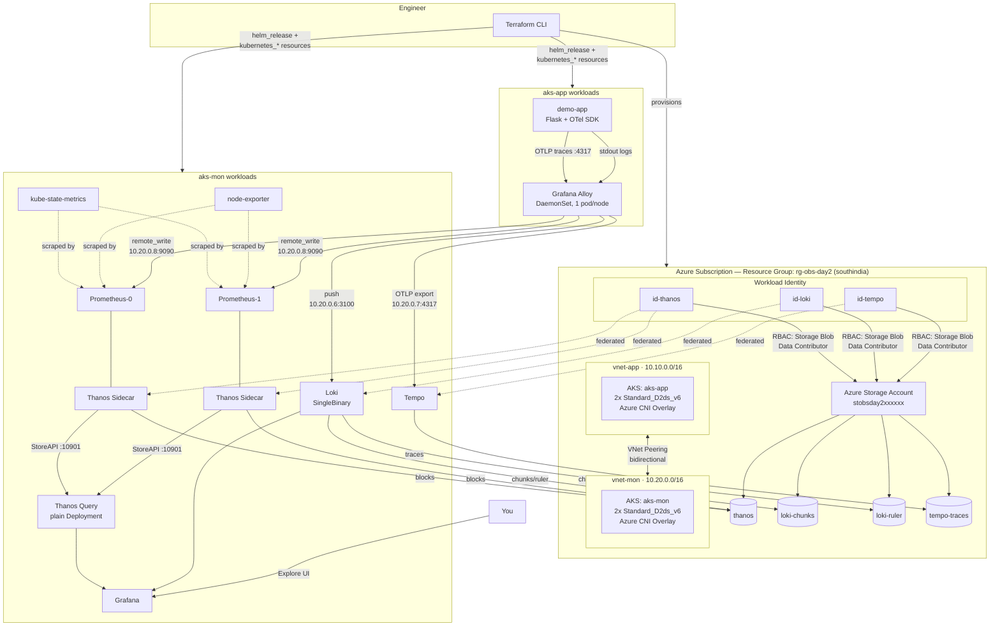
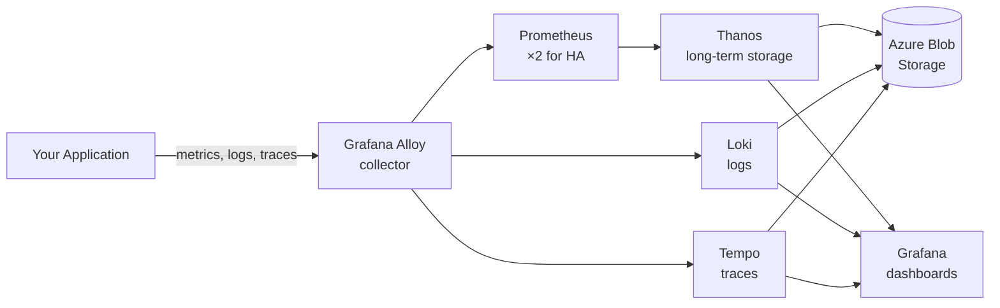

# Azure Observability Platform

A highly available observability stack on Azure — two peered AKS clusters, Prometheus running twice with Thanos handling deduplication and long-term storage, Loki for logs, Tempo for traces, all fed by a single Grafana Alloy agent, all authenticated with Azure Workload Identity instead of a password. Built with Terraform, deployed with Helm.

> [!NOTE]
> This README describes what's actually running in this repository. Where something isn't implemented — CI/CD, automated tests — it's marked as future work rather than implied.

---

## Table of Contents

1. [What This Is](#what-this-is)
2. [Architecture](#architecture)
3. [Technology Stack](#technology-stack)
4. [Prerequisites](#prerequisites)
5. [Repository Structure](#repository-structure)
6. [Deployment](#deployment)
7. [Design Deep Dives](#design-deep-dives)
8. [Validation](#validation)
9. [PromQL Reference](#promql-reference)
10. [Command Reference](#command-reference)
11. [Challenges and Troubleshooting](#challenges-and-troubleshooting)
12. [Cost and Cleanup](#cost-and-cleanup)
13. [CI/CD — Future Work](#cicd--future-work)
14. [Testing — Future Work](#testing--future-work)
15. [What You Will Learn](#what-you-will-learn)
16. [Interview Questions](#interview-questions)
17. [Future Improvements](#future-improvements)
18. [Portfolio Summary](#portfolio-summary)

---

## What This Is

The starting point for this project was a single Prometheus instance on a single Azure VM. It worked fine, and it had the obvious problem every single-instance monitoring setup has: the thing that's supposed to tell you something broke is itself a single point of failure.

This repository is the fix. Two AKS clusters — one running the application being observed, one running the observability platform itself — connected by a private network peering. Prometheus runs as two independent replicas. Thanos ships their data to Azure Blob Storage for long-term retention and deduplicates the two replicas at query time. Loki holds logs, Tempo holds traces, and Grafana Alloy collects all three signals from the application in one pass, with consistent labels across all of them. Every component that needs to write to storage does so through Azure Workload Identity — there's no password or key anywhere in this codebase, by design.

Everything here, including the Kubernetes and Helm layer on top of the raw Azure infrastructure, is provisioned by Terraform. The Challenges section further down is not filler — it covers four separate Helm charts that each hid their real configuration behavior somewhere the values schema didn't make obvious, and one genuinely frustrating stretch spent figuring out that Alloy's config language uses `//` for comments, not `#`.

---

## Architecture

### Full architecture



### Simplified view



### Workload identity flow

```mermaid
flowchart LR
    SA["Kubernetes ServiceAccount<br/>(e.g. monitoring/thanos)"] -->|signed OIDC token| Issuer["AKS OIDC Issuer"]
    Issuer -->|trust relationship| FIC["Federated Identity Credential<br/>subject: system:serviceaccount:monitoring:thanos"]
    FIC --> MI["Azure Managed Identity<br/>(id-thanos)"]
    MI -->|token exchange| AAD["Azure AD"]
    AAD -->|short-lived access token| RBAC["RBAC: Storage Blob<br/>Data Contributor<br/>scoped to ONE container"]
    RBAC --> Blob[(Blob Container)]
```



> [!NOTE]
> GitHub renders these Mermaid diagrams natively, so there's nothing to do to view them. For a portable PNG (a slide deck, a LinkedIn post), export any block with the [Mermaid CLI](https://github.com/mermaid-js/mermaid-cli):
> ```bash
> npx @mermaid-js/mermaid-cli -i docs/architecture.mmd -o docs/day2-architecture.png
> ```
> There's no pre-rendered image checked into this repo — the Mermaid source above is the actual source of truth.

---

## Technology Stack

| Layer | Technology | Purpose |
|---|---|---|
| IaC | Terraform (`azurerm`, `kubernetes`, `helm`, `random` providers) | Provisions Azure infrastructure and the in-cluster Kubernetes/Helm layer from one state file |
| Compute | Azure Kubernetes Service ×2 | Application cluster and monitoring cluster |
| Networking | Azure VNet + Peering | Isolated networks, one explicit path between them |
| Metrics | Prometheus (`kube-prometheus-stack`), 2 replicas | Scraping, short-term local storage |
| Long-term metrics | Thanos (Sidecar + Query) | Deduplication across HA replicas, long-term storage in Blob |
| Logs | Loki (SingleBinary) | Log aggregation, indexed by label |
| Traces | Tempo | Distributed tracing, indexed by trace ID |
| Collection | Grafana Alloy (DaemonSet) | One agent, three signals, consistent labels |
| Visualization | Grafana | One query layer across Thanos, Loki, and Tempo |
| Identity | Azure Workload Identity (OIDC federation) | No static credentials for storage access |
| Object storage | Azure Blob Storage, 4 containers | Backing store for Thanos, Loki, Tempo |

---

## Prerequisites

- An Azure subscription. Free Trial subscriptions carry a hard 4 vCPU regional cap that blocks a two-cluster build outright — see [Challenges](#challenges-and-troubleshooting). Pay-As-You-Go, with the free trial credit still applied, is what this was actually built on.
- `az` CLI, authenticated
- Terraform >= 1.9
- `kubectl`
- `helm` — used for `helm show values` / `helm template` during development, not required at deploy time since the `helm` provider drives the actual releases
- A budget alert on the subscription, set before deploying anything

---

## Repository Structure

One Terraform working directory, split into a file per concern rather than one long `main.tf`. Terraform reads every `.tf` file in a directory as a single configuration regardless of which file a block lives in, so the split is purely organizational — verified with `terraform plan` showing zero diff before and after.

```
azure-observability-framework/
├── .gitignore            # Excludes *.tfstate, .terraform/, *.tfvars, .DS_Store
└── terraform/
    ├── providers.tf       # terraform{}, the azurerm provider, and the default +
    │                      #   aliased kubernetes/helm provider pairs
    ├── network.tf         # Resource group, both VNets, both subnets, peering
    ├── clusters.tf        # Both azurerm_kubernetes_cluster resources
    ├── storage.tf         # Storage account and its 4 containers
    ├── identity.tf        # Workload identities, federated credentials,
    │                      #   per-container RBAC, and the cluster's own
    │                      #   Network Contributor grant on vnet-mon
    ├── prometheus.tf      # kube-prometheus-stack, plus the Thanos sidecar's
    │                      #   ServiceAccount and object-storage Secret
    ├── thanos-query.tf    # Thanos Query — a plain Deployment/Service,
    │                      #   not a Helm chart (see Design Deep Dives)
    ├── grafana.tf         # Admin Secret + helm_release
    ├── loki.tf            # helm_release, plus a standalone internal
    │                      #   LoadBalancer Service
    ├── tempo.tf            # helm_release
    ├── alloy.tf            # aks-app's namespace, the Alloy helm_release
    │                       #   (provider = helm.app), and its OTLP Service
    ├── demo-app.tf         # The Flask demo application
    ├── variables.tf        # Region, node size/count, CIDR ranges, tags
    ├── output.tf           # Cluster names, subnet IDs, OIDC issuer URLs,
    │                       #   identity client IDs, storage account name,
    │                       #   Grafana admin password (sensitive)
    ├── example.tfvars      # Copy to terraform.tfvars — the handful of
    │                       #   values worth checking before your first apply
    └── .terraform.lock.hcl # Pinned provider versions
```

> [!NOTE]
> `terraform.tfstate` is gitignored and isn't part of this repository — it holds resource IDs and the Grafana admin password in plaintext. Cloning this repo and running `terraform init && terraform apply` builds you a fresh, independent environment; it doesn't attach to anything.

There's no `modules/`, `tests/`, or `docs/` split yet — see [Future Improvements](#future-improvements).

---

## Deployment

```bash
cd terraform
cp example.tfvars terraform.tfvars   # check location and node_size against your
                                      #   own subscription's quota before applying —
                                      #   see Prerequisites and Challenges #1–2
terraform init
terraform plan
terraform apply
```

> [!IMPORTANT]
> Every `kubectl ... --context aks-mon` / `--context aks-app` command in this README needs those two contexts to exist in your local kubeconfig. Terraform's own providers don't need this — they read cluster credentials straight off `azurerm_kubernetes_cluster.*.kube_config` — but running `kubectl` by hand afterward does:
> ```bash
> az aks get-credentials -g $(terraform output -raw resource_group_name) \
>   -n $(terraform output -raw mon_cluster_name) --context aks-mon
> az aks get-credentials -g $(terraform output -raw resource_group_name) \
>   -n $(terraform output -raw app_cluster_name) --context aks-app
> ```

`terraform apply` provisions, in an order Terraform infers automatically from resource references rather than anything hand-written:

1. Resource group, both VNets, both subnets, the peering (two resources, not one — Azure models a peering as a property of each network)
2. Both AKS clusters, in parallel, since nothing references the other
3. Storage account and its 4 containers
4. Three managed identities, their federated credentials, and per-container RBAC
5. `kube-prometheus-stack` (Prometheus HA and the Thanos sidecar), Thanos Query, Grafana, Loki, Tempo — all in `aks-mon`
6. Grafana Alloy, in `aks-app`, through a second, aliased set of `kubernetes`/`helm` provider configs (see [Terraform](#terraform))
7. The demo application, also in `aks-app`

```bash
kubectl get pods -n monitoring --context aks-mon
kubectl get pods -n monitoring --context aks-app
```

---

## Design Deep Dives

### Why two AKS clusters

An observability platform ends up with elevated access into whatever it's watching. Put the workload and the platform in one network and everything can reach everything by default. Two clusters, two VNets, with a single explicit peering as the only path between them, means the telemetry path is something you can actually see and control rather than an implicit side effect of shared infrastructure. It also caps blast radius — a compromise or misconfiguration in the application cluster doesn't automatically expose the platform watching it, and the reverse holds too.

### Network separation and connectivity

`vnet-app` (`10.10.0.0/16`) and `vnet-mon` (`10.20.0.0/16`) are peered with `allow_virtual_network_access` and `allow_forwarded_traffic` on both sides. Two things matter here:

Only real VNet address space is routable across the peering. Pod IPs (the Azure CNI overlay ranges) and Kubernetes Service virtual IPs are cluster-internal and never cross it, regardless of how the networks are connected — `*.svc.cluster.local` names resolve only inside the cluster that owns them.

So anything in `aks-app` that needs to reach something in `aks-mon` — Alloy reaching Prometheus, Loki, or Tempo — needs a Service with a real private IP from the node subnet on the `aks-mon` side: a `LoadBalancer` Service annotated `service.beta.kubernetes.io/azure-load-balancer-internal: "true"`. That's not an optional refinement; it's the only mechanism that actually crosses the boundary. The addresses are in the [Alloy](#alloy) section below.

### Terraform

| Concept | What it means here |
|---|---|
| Provider | A plugin translating HCL into an API. Four in use: `azurerm`, `kubernetes` and `helm` (each with a default instance pointed at `aks-mon` and an aliased instance, `kubernetes.app`/`helm.app`, pointed at `aks-app`), and `random` for the admin password and storage-account suffix |
| Resource | A declared thing that should exist — `azurerm_kubernetes_cluster`, `helm_release`, `kubernetes_service`, and so on |
| Variable | Typed inputs — region, node size, CIDR ranges — rejected at plan time if the type's wrong, not mid-apply |
| Output | Cluster names, subnet IDs, OIDC issuer URLs, identity client IDs — the interface other configs, or a human, can read |
| State | Terraform's own record mapping what it declared to real Azure/Kubernetes object IDs. Anything created outside that record is invisible to it until imported (see Challenges) |
| Dependency graph | Built entirely from HCL references. `depends_on` is used sparingly, only where a Helm values string is a hardcoded DNS name with no Terraform attribute behind it |
| Idempotency | `apply` run twice with nothing changed reports `0 changed`. Demonstrated repeatedly here by a recurring, harmless AKS `upgrade_settings` drift that Azure keeps re-asserting |
| Provider chaining | The `kubernetes`/`helm` blocks read credentials straight off `azurerm_kubernetes_cluster.mon.kube_config[0]` — no `az aks get-credentials`, no kubeconfig file needed for Terraform's own operations |

### Kubernetes provider and Helm provider — and where `kubectl` fits

Three tools, three jobs. Terraform owns the lifecycle — create, update, destroy — of both the Azure infrastructure and, through the `kubernetes`/`helm` providers, the Kubernetes objects and Helm releases. Helm, invoked through Terraform's provider rather than run standalone, packages a chart's many Kubernetes objects into one deployable unit — a `helm_release` in Terraform corresponds to potentially dozens of underlying objects, tracked as a single resource. `kubectl` shows up throughout purely for inspection and debugging: reading logs, checking a rendered ConfigMap, port-forwarding to hit an endpoint directly. It never created anything Terraform is expected to own.

### Prometheus High Availability

Deployed as a StatefulSet, via `kube-prometheus-stack` with `replicas: 2`, not a Deployment. Two things a StatefulSet gives you that a Deployment doesn't: stable pod identity (always `prometheus-...-0` and `-1`, never renamed on reschedule) and stable PVC association (pod `-0` always reattaches to its own volume, never the other one's).

Both matter because the two replicas are independent, uncoordinated Prometheus processes. They scrape the same targets on the same interval, but not in lockstep — each runs its own scrape timer, so samples land at slightly different timestamps. They don't hold identical data at any given instant, and they never will.

Each replica tags itself with an external label:

```yaml
externalLabels:
  replica: "$(POD_NAME)"
```

confirmed in the running config as:

```yaml
external_labels:
  prometheus: monitoring/kube-prometheus-kube-prome-prometheus
  replica: prometheus-kube-prometheus-kube-prome-prometheus-0   # -1 on the other pod
```

That label is the only thing making deduplication possible downstream. Without it, Thanos Query has no way to know two slightly different series are the same metric from two replicas, and every graph shows doubled, overlapping lines.

What HA actually buys you: coverage for the window where one replica is down or being rescheduled — the moment monitoring is most likely to be needed. What it doesn't buy you: protection from a wrong scrape config, a bad alert rule, or a broken query. Both replicas run the identical configuration, so if it's wrong, it's wrong on both, identically.

Local retention is deliberately short — `retention: "6h"`. Prometheus is a recent-data buffer here; Thanos owns everything older.

### Grafana

The Thanos datasource points at Thanos Query, never at either Prometheus replica directly:

```yaml
- name: Thanos
  type: prometheus
  uid: thanos
  access: proxy
  url: http://thanos-query.monitoring.svc.cluster.local:9090
  isDefault: true
  editable: false
```

Querying a replica directly would silently show only that replica's view — no error, just a dashboard quietly missing data during that replica's downtime. Thanos Query fans out to both, deduplicates on the `replica` label, and returns one merged answer. Grafana never has to know HA exists.

`editable: false` means an admin can't change the datasource's connection details through the UI — any real change goes through Terraform, so the declared and running configurations can't silently drift apart.

Persistence is disabled (`persistence.enabled = false`), and that's a stated trade-off, not an oversight. Any dashboard built through the UI lives only in that pod's ephemeral storage and is gone the moment the pod reschedules. The datasource survives regardless, because it's provisioned via a ConfigMap the chart remounts on every start — provisioned config comes back on its own; UI-created state doesn't, because nothing re-applies it.

Grafana's own Service is `type: LoadBalancer` with no internal annotation — the one component here deliberately given a public IP, because a person outside both clusters needs to reach the UI directly. That has a real, ongoing cost and exposure story — see [Cost and Cleanup](#cost-and-cleanup).

All three datasources — Thanos, Loki, Tempo — are provisioned and were confirmed working directly in the UI, not just via API calls. The correlation this whole platform exists to enable was checked end to end through Explore: a trace opened by ID (`handle-request`, `demo-app`, `230.64ms`) rendered with its Service/Duration/Kind metadata, and a second, freshly generated request (`"handled request in 0.160s"` in Loki, matched against its span in Tempo's Search tab) confirmed the same correlation on live data, not just the one original trace.

### Azure Blob Storage

One storage account, four containers, each written by exactly one workload identity:

| Container | Written by | Contents |
|---|---|---|
| `thanos` | Both Prometheus sidecars | Sealed TSDB blocks, uploaded roughly every 2 hours. Both replicas upload independently, so this container holds two overlapping copies of the same data until a Compactor (not deployed here) would merge them at rest |
| `loki-chunks` | Loki | Compressed log chunk data |
| `loki-ruler` | Loki | Alerting-rule evaluation state |
| `tempo-traces` | Tempo | Trace span data |

`is_hns_enabled = false` is deliberate — hierarchical namespace changes how blobs are addressed and breaks the S3-compatible client libraries all three tools rely on.

### Azure Workload Identity

Thanos, Loki, and Tempo all authenticate to Blob Storage with no password, key, or secret anywhere — not in a Kubernetes Secret, not in Terraform state as a credential. The mechanism:

```
Kubernetes ServiceAccount (namespace/name — e.g. monitoring/thanos)
        ↓  issues a signed OIDC token
Azure trusts this cluster's OIDC issuer, for this exact ServiceAccount
        ↓  (that trust relationship is the Federated Identity Credential)
Azure exchanges the token for a short-lived Azure AD access token
        ↓
Scoped to whatever Azure RBAC role the target Managed Identity holds
        ↓
Access to Blob Storage — the token auto-rotates, roughly an hour's lifetime
```

Preferable to a storage account key for three reasons: nothing long-lived exists to leak, the token auto-rotates with no manual step, and it's scoped to exactly what the RBAC assignment grants rather than the whole account.

### Federated Identity Credential

The `subject` field has to match the consuming ServiceAccount exactly — namespace and name, character for character:

```
system:serviceaccount:monitoring:thanos
system:serviceaccount:monitoring:loki
system:serviceaccount:monitoring:tempo
```

This is the single most important lesson in the whole build. A mismatched or missing subject produces no Terraform error, no scheduling failure, nothing at the point of mismatch. The pod starts. It reports `Running`, `Ready`. Only later, when the application's storage client actually tries to use credentials that were never injected, does anything surface — either a plain `403` (falling back to the node's own identity, which has no storage RBAC), or, in one real case here, the message `"no supported bucket was configured, uploads will be disabled"` — which reads like a config-content problem and is actually an identity-wiring problem three layers upstream. This happened and was fixed during this build; see [Challenges](#challenges-and-troubleshooting).

### Azure RBAC

Every identity gets `Storage Blob Data Contributor`, scoped to a container, never the storage account:

```hcl
resource "azurerm_role_assignment" "thanos_storage" {
  scope                = azurerm_storage_container.thanos.id
  role_definition_name = "Storage Blob Data Contributor"
  principal_id         = azurerm_user_assigned_identity.workload["thanos"].principal_id
}
```

That role grants read, write, and delete on blob data within its scope — no management-plane rights like creating or deleting containers. Because the scope is a single container's resource ID, the Thanos identity genuinely can't reach `loki-chunks`, `loki-ruler`, or `tempo-traces` — Azure enforces that at the API level. Loki has two separate role assignments, for `loki-chunks` and `loki-ruler`, because a single `azurerm_role_assignment` can only target one scope; granting access to two containers is mechanically two assignments.

A separate RBAC grant exists on the AKS cluster's own control-plane identity — `Network Contributor` on `vnet-mon`, unrelated to the three workload identities above. This surfaced mid-build: an AKS cluster using a custom, pre-existing VNet needs its control-plane identity to have write access on that VNet to provision things like internal load balancers.

### Thanos

```
Prometheus (×2, independent)
    ↓
Thanos Sidecar (one per Prometheus pod, shares the pod's local disk)
    ↓  uploads sealed blocks every ~2h, via the identity above
Blob Storage (container: thanos)
    ↓
Thanos Query (a plain Deployment — see note)
    ↓  --query.replica-label=replica, fans out via
    ↓  --store=dns+prometheus-operated.monitoring.svc.cluster.local:10901
Grafana
```

> [!NOTE]
> Thanos Query is a plain `kubernetes_deployment`/`kubernetes_service` pair, not a Helm chart. It started life on the Bitnami `thanos` chart, whose default image returned zero tags mid-build — Bitnami pulled its free-tier Docker Hub images in August 2025. Rather than pin to the frozen `bitnamilegacy` archive, the chart was dropped for a plain Deployment running `quay.io/thanos/thanos:v0.36.1`, the same actively maintained image the sidecar itself uses.

Store Gateway and Compactor aren't deployed, to keep the footprint inside a 2-node budget. Long-term storage works — data lands in Blob, Thanos Query can read it — but historical queries are unoptimized without a Store Gateway, and blocks aren't deduplicated at rest without a Compactor.

### Alloy

Deployed to `aks-app` as a DaemonSet — the chart's own default — one pod per node, since log tailing and container discovery are inherently local to a node. Three pipelines, written in Alloy's own configuration syntax, which uses `//` for comments, not `#` (see Challenges):

```river
prometheus.scrape "node_metrics" { ... }
prometheus.remote_write "to_prometheus" {
  endpoint { url = "http://10.20.0.8:9090/api/v1/write" }
}

discovery.kubernetes "pods" { role = "pod" }
loki.source.kubernetes "pod_logs" { ... forward_to = [loki.write.to_loki.receiver] }
loki.write "to_loki" {
  endpoint { url = "http://10.20.0.6:3100/loki/api/v1/push" }
}

otelcol.receiver.otlp "otlp_receiver" { grpc { endpoint = "0.0.0.0:4317" } ... }
otelcol.exporter.otlp "to_tempo" {
  client { endpoint = "10.20.0.7:4317"; tls { insecure = true } }
}
```

All three destinations are private internal-LoadBalancer IPs on `vnet-mon`'s node subnet, not DNS names, because Alloy runs in a different cluster than everything it's sending data to. This is also why Prometheus needed its own internal load balancer for the first time — nothing before Alloy had ever needed to reach it from outside `aks-mon`.

| Destination | Private IP | Exposed via |
|---|---|---|
| Loki push API | `10.20.0.6:3100` | A standalone `kubernetes_service` — Loki's own `singleBinary.service.type` is a dead key in the chart (see Challenges), so its built-in Service can't be made internal directly |
| Tempo OTLP | `10.20.0.7:4317` | Chart-native `service.type` plus the internal annotation — this chart does honor it |
| Prometheus remote_write | `10.20.0.8:9090` | Same, chart-native and honored |

### Demo application

Online Boutique, the original reference app, wasn't deployed — its eleven microservices want 4–6 GiB, which doesn't fit the node budget alongside Alloy's own DaemonSet. In its place: a small, self-contained Flask app, delivered as a `kubernetes_config_map` mounted into a stock `python:3.12-slim` container, with dependencies installed at container start. That's a stated trade-off for avoiding a registry and a build step, not something you'd ship for real.

It exposes `/`, which opens one OpenTelemetry span (`handle-request`) with a random 50–300ms delay recorded as an attribute, and logs `"handled request in Xs"` to stdout — plus `/healthz`. Deliberately the smallest thing that exercises the whole pipeline: one request, one span, one log line, fully correlatable.

Confirmed end to end, with real data: five requests to `/` produced five matching spans in Tempo and five matching log lines in Loki, timestamps and durations aligned. Trace `1745925fd4b71ca8a3bdf47525cf69f5` (230ms) was cross-referenced directly against the Loki line `"handled request in 0.230s"` for the same pod at the same second. The metrics path was separately confirmed through `alloy_build_info`, a self-metric Alloy exposes, queryable through Thanos Query — proving the full chain from Alloy's remote_write through Prometheus, the sidecar, Blob Storage, and back out through Thanos Query.

---

## Validation

| Layer | How it was actually checked |
|---|---|
| Terraform | `terraform plan` before every apply; drift confirmed harmless via repeated `0 changed` after re-applying |
| Kubernetes | `kubectl get pods/pvc/svc -n monitoring` on both cluster contexts |
| Prometheus | `curl http://localhost:9090/-/ready`; external labels checked by reading the rendered config directly (`/etc/prometheus/config_out/prometheus.env.yaml`), not by querying `/api/v1/query` — see Challenges for why that's the wrong check |
| Grafana | Save & Test on each provisioned datasource |
| Thanos | `curl http://localhost:9091/api/v1/stores` — both sidecars visible, each with a distinct `replica` label; sidecar logs checked directly for `"upload new block"` to confirm real writes, not just reachability |
| Azure Blob Storage | `az storage container list --account-name <name> --auth-mode login` |
| Workload Identity | `kubectl get pod ... -o yaml \| grep azure.workload.identity/use` on the actual pod, cross-checked against sidecar logs for a successful upload, not just an attempted one |
| Integration | Real HTTP traffic to the demo app, the resulting trace pulled directly from Tempo and the resulting log line pulled directly from Loki, matched by timestamp |

No automated test suite exercises any of this yet — see [Testing](#testing--future-work).

---

## PromQL Reference

All queries run against the Thanos datasource — deduplicated, not either Prometheus replica directly.

| Query | Measures | Healthy result | Why it matters |
|---|---|---|---|
| `up` | Last-scrape success/failure per target | Every series `== 1` | The single most load-bearing metric in Prometheus |
| `count(up)` | Total scrape targets | A stable, expected number | A sudden drop means targets disappeared from discovery |
| `up == 0` | Targets currently failing | Empty | The direct "what's broken right now" query |
| `count by (job) (up)` | Target count per job | Matches your expected topology | Localizes a drop to one job instead of the whole cluster |
| `prometheus_build_info` | Prometheus's own build metadata | One series per process | Confirms which binary is actually running |
| `count(prometheus_build_info)` | Distinct Prometheus processes | `2` in this build | Direct confirmation both HA replicas are alive |
| `prometheus_tsdb_head_series` | Active series in the head block | Stable, bounded | Runaway growth shows up here first |
| `rate(prometheus_tsdb_head_samples_appended_total[5m])` | Samples ingested per second | Roughly constant | The direct ingestion-rate measure |
| `prometheus_config_last_reload_successful` | Last reload's success | `1` | `0` means the running config is stale relative to disk |
| `alloy_build_info` | Alloy's own build metadata | Present, correct version | The actual end-to-end proof used here that Alloy → Prometheus → Thanos → Blob → Thanos Query works |

---

## Command Reference

```bash
# Kubernetes inspection
kubectl get pods -n monitoring --context aks-mon
kubectl get pvc -n monitoring --context aks-mon
kubectl get pod -n monitoring <pod> -o jsonpath='{.spec.containers[*].name}'
kubectl get pod -n monitoring <pod> -o yaml | grep azure.workload.identity/use
kubectl logs -n monitoring <pod> -c thanos-sidecar --tail=50

# Reaching a service directly
kubectl port-forward -n monitoring <pod> 9090:9090
curl http://localhost:9090/-/ready
curl -s http://localhost:9090/api/v1/status/config

# Terraform
terraform init
terraform plan
terraform apply
terraform state list
terraform import <resource_address> <azure_resource_id>
terraform destroy

# Azure
az aks start -g rg-obs-day2 -n aks-mon
az aks stop  -g rg-obs-day2 -n aks-mon --no-wait
az storage container list --account-name <name> --auth-mode login -o table
az network lb list -g MC_rg-obs-day2_aks-mon_southindia --query "[].name" -o table

# Helm — used to inspect chart behavior during development;
# the releases themselves come from Terraform's helm provider
helm repo add grafana https://grafana.github.io/helm-charts
helm show values grafana/loki | grep -A10 "^serviceAccount:"
helm template grafana/loki --set singleBinary.service.type=LoadBalancer
```

---

## Challenges and Troubleshooting

### 1. AKS rejected the availability zone

Setting `default_node_pool.zones = ["1", "2"]` on both clusters produced:

```
AvailabilityZoneNotSupported: The zone(s) '2' for resource 'system' is not
supported. The supported zones for location 'southindia' are ''
```

That's a region-capability issue, not quota — `southindia` doesn't support AZ-pinned node pools for this config, full stop. The fix was dropping `zones` entirely. This isn't a universal answer; a region that does support AZs would make zone-pinning both valid and a real reliability win. It was dropped here because this specific region doesn't support it, not because the idea itself is wrong.

### 2. A four-vCPU wall, and a quota gap specific to one VM family

Separately: the subscription started on Azure's Free Trial tier, which caps total vCPUs across every VM family combined, per region, at 4 — well below the 10–20 most people expect from a normal subscription. The original two `D4s_v5` nodes per cluster needed 16 vCPUs; even the minimum viable shape blew past 8.

Upgrading to Pay-As-You-Go raised the regional default to 10. A second, more specific gap then showed up: Azure enforces quota per VM family as well as per region, and the `DSv5` family — which `D2s_v5`/`D4s_v5` both draw from — sat independently capped at 0, even with regional headroom. A family-specific quota increase, approved for `Ddsv6`, is what actually unblocked things. `Standard_D2ds_v6` is the final node size because it was the first family with usable quota, not because it was the plan.

Region acceptance, SKU availability, family-level quota, and region-level quota are four independent gates. Checking one and assuming the rest follow cost real time here, twice.

### 3. Validating Prometheus's external labels the wrong way

The obvious check —

```bash
curl -s 'http://localhost:9090/api/v1/query?query=up' | python3 -m json.tool | grep replica
```

— returned nothing, and looked like the label wasn't applying. It was never going to show up there. Prometheus doesn't attach `external_labels` to results from its own local `/api/v1/query`; that only happens at federation, remote_write, and the status page. The real check is reading the rendered config off the pod directly:

```bash
kubectl exec <pod> -c prometheus -- cat /etc/prometheus/config_out/prometheus.env.yaml | grep -A3 external_labels
```

which correctly showed `replica: prometheus-...-0` (and `-1`) from the start. The label was right the whole time; the check was wrong.

### 4. config-reloader warnings that never got a fully confirmed root cause

While chasing the above, config-reloader logged real, repeated warnings:

```
trigger reload: received non-200 response: 500 Internal Server Error;
have you set `--web.enable-lifecycle` Prometheus flag?
```

That flag was confirmed present on the running process already, added automatically by the Prometheus Operator, so the generic hint wasn't the actual cause. The reload did eventually succeed. What exactly caused the intervening failures was never fully pinned down — worth saying plainly rather than presenting a guess as a finding.

### 5. The identity-labeling bug, three times, in three places

The Azure workload-identity webhook mutates based on the pod's own labels, never the ServiceAccount's. A `serviceAccount.labels` field existing in a chart's values — even sitting right next to `annotations` — isn't proof it reaches the pod. This bit three separate components independently, each requiring a read of that chart's actual template source to find the real field:

- Prometheus Operator: `prometheusSpec.podMetadata.labels` (and `serviceAccountName` inside `prometheusSpec` is a dead field entirely — the real ServiceAccount comes from a sibling `serviceAccount.{create,name}` block)
- Loki: `singleBinary.podLabels`
- Tempo: a bare top-level `podLabels`, no nesting at all

Three charts, three different field names, no shared convention.

### 6. Loki: a dead `service.type` key

`singleBinary.service.type = LoadBalancer` produced no error and no internal LB, because Loki's `templates/single-binary/service.yaml` hardcodes `type: ClusterIP` and never reads that field — confirmed by reading the template. Fixed with a standalone `kubernetes_service`, targeting the same pods by label, alongside the chart's own ClusterIP Service rather than replacing it.

### 7. Loki: ring quorum failure with one instance

`/ready` succeeded, `/loki/api/v1/labels` failed with:

```
rpc error: code = Code(500) desc = too many unhealthy instances in the ring
```

`common.replication_factor` was still `3`, the chart's multi-instance default, despite `SingleBinary` mode and one real replica. Quorum math expected two replicas that don't exist and marked them unhealthy. Fixed with `replication_factor = 1`, confirmed against the chart's own single-binary example before applying.

### 8. Prometheus's remote_write receiver was off

Alloy's writes failed with a `404` until `prometheusSpec.enableRemoteWriteReceiver = true` was added. After the fix, the same probe returned `415 Unsupported Media Type` — the correct result, since remote_write needs a specific protobuf content type the probe never sent. The status changing from `404` to `415` was the actual proof, not the probe succeeding outright.

### 9. Cross-cluster DNS, and a config that silently never reloaded

Alloy's config first pointed at `kube-prometheus-kube-prome-prometheus.monitoring.svc.cluster.local` — resolvable only inside `aks-mon`, and Alloy runs in `aks-app`. The failure persisted after the fix was written, for a second reason: the fix's own comment used `#` instead of `//`. Alloy's config language isn't YAML — it borrows Go's comment syntax — and the `#` caused a hard parse failure on every reload, which meant the previous, broken config kept running underneath, silently. What looked like one stubborn failure was actually two, stacked. The lesson that mattered more than the fix itself: when a change doesn't seem to take effect, check whether it actually loaded before re-diagnosing the original symptom.

### 10. Terraform idempotency, and one deliberate risk worth naming honestly

`apply` run twice with nothing changed reliably reported `0 added, 0 changed, 0 destroyed`. A recurring, harmless exception was AKS's own default `upgrade_settings` reasserting itself between sessions — flagged as drift each time, resolved identically each time.

Two separate incidents, worth keeping apart:

- A genuine `Unexpected Identity Change` error on `kubernetes_service.loki_lb` — a provider-level issue, not something this project's own code caused. The `kubernetes` provider added a resource-identity tracking feature after this resource's state was created, found a stale/empty identity, and refused to reconcile rather than backfill it. Fixed cleanly with `terraform state rm` followed by `terraform import` — pure bookkeeping, the live object was never touched.
- A separate anti-pattern worth calling out on its own: at one point, a required RBAC role assignment was granted manually through the Azure CLI while a `terraform apply` was still running in another terminal, specifically to avoid waiting. It didn't collide this time, but it left a role assignment Terraform's own config would otherwise have tried to create a redundant copy of — reconciled afterward with `terraform import`. Running an independent mutation against a Terraform-managed resource while an apply is in flight is a bad habit regardless of whether it happens to collide. Letting the apply finish or fail, then fixing forward, is the safer path.

### 11. A restarted cluster doesn't guarantee the same pod, and Loki logs don't follow a pod across that gap

After stopping and restarting both clusters between sessions, the demo app came back as a different pod — same Deployment, new name. Querying Loki for the original pod's logs, hours later, against the new pod, returned nothing — not because Loki was broken, but because that pod's log stream genuinely doesn't exist anymore to query.

This didn't touch the already-captured trace — Tempo stores by trace ID, independent of whether the originating pod still exists, so the original trace stayed fully valid. But it means the "click a trace, find its matching log" workflow only reliably works within the lifetime of the pod that generated both signals — worth knowing before relying on it days later. Re-verified cleanly by generating a fresh request and matching both signals within minutes rather than trying to recover the original pair.

---

## Cost and Cleanup

Everything here costs something while running:

- **Two AKS clusters** are the largest ongoing cost. `az aks stop` deallocates node compute but doesn't delete the cluster object, its managed identities, or any `LoadBalancer` Services.
- **`LoadBalancer` Services** provision a real Azure Load Balancer and, for public ones, a Public IP — billed independently of cluster power state. Grafana's Service here is public and was explicitly deleted between sessions for exactly that reason.
- **Storage** is negligible at this data volume, but non-zero and ongoing.
- **Two Prometheus replicas** roughly double scrape load and local disk usage over a single instance — a direct cost of the HA design.
- **Thanos storage** accumulates indefinitely with no Compactor to deduplicate or expire it, so it grows over time even though it's small right now.

Between sessions:

```bash
kubectl delete service grafana -n monitoring
az network lb list -g MC_rg-obs-day2_aks-mon_southindia --query "[].name" -o table
az aks stop -g rg-obs-day2 -n aks-mon --no-wait
az aks stop -g rg-obs-day2 -n aks-app --no-wait
```

To tear the whole thing down:

```bash
terraform destroy
```

That removes everything Terraform's state tracks — both clusters and everything Azure created on their behalf, both VNets and the peering, storage, and all three identities and their role assignments. Deleting one Kubernetes Service, as done for Grafana between sessions, only removes that one Service — it's not a substitute for `terraform destroy`.

---

## CI/CD — Future Work

Nothing exists here yet. A realistic shape, given the architecture:

```
Code → Git → CI runner
  → terraform validate
  → terraform plan (posted for review)
  → terraform apply (on merge, with an approval gate)
  → smoke checks (pod readiness, datasource Save & Test equivalents)
  → an observability self-check (query alloy_build_info through Thanos,
     confirming the pipeline documented in this README is still intact)
```

A proposal, not an implementation.

---

## Testing — Future Work

No automated suite exists. Every check in this README was done manually, once, and recorded here. A natural next step: a small pytest suite asserting the things that were re-verified by hand repeatedly during this build — each workload's pod carries the identity label (not just the ServiceAccount), each internal LB has a real IP rather than `<pending>`, Prometheus's external labels are correct when read from the rendered config, and Thanos Query's `/api/v1/stores` shows exactly two entries with distinct replica values. This is the same test-layering approach used in this project's Day 1 companion repo — infrastructure and config-state assertions catching drift that a bare health check structurally can't see.

---

## What You Will Learn

- Provisioning AKS with Terraform, including multi-cluster, multi-provider-alias configurations
- Managing Azure infrastructure and in-cluster Kubernetes/Helm resources from one Terraform state
- Deploying a full observability stack via Helm
- What Prometheus HA actually protects against, and what it doesn't
- Why StatefulSets exist and what they guarantee that Deployments don't
- Validating Prometheus external labels correctly — and why the obvious method is the wrong one
- The Thanos sidecar/Query split and why deduplication needs a shared label convention
- Blob Storage as a backing store for three different observability systems
- Azure Workload Identity end to end: ServiceAccount → OIDC → Federated Credential → Managed Identity → RBAC
- The specific, silent failure mode of a misconfigured workload identity
- Least-privilege RBAC scoped to individual storage containers
- PromQL
- Debugging Helm deployments by reading chart template source, not just the values schema
- Recognizing and resolving Terraform state drift, including drift caused by out-of-band changes
- The real cost and cleanup difference between a `LoadBalancer` Service and cluster power state

---

## Interview Questions

**Why a StatefulSet instead of a Deployment for Prometheus?**
It gives each pod a stable identity and reattaches it to the same PersistentVolumeClaim on every reschedule. That stability is what makes the `replica` label — and therefore Thanos deduplication — mean anything; a Deployment's interchangeable pods would break the association.

**Why two Prometheus replicas?**
A single instance is monitoring's own single point of failure, and it's the thing that would have told you something else broke. Two independent replicas cover the window while one is down or rescheduling.

**Why aren't the replicas synchronized?**
Each runs its own scrape loop on its own timer, by design — coordinating them would add complexity for no real benefit, since the goal is availability, not identical data.

**Why does the `replica` label matter?**
Without it, Thanos Query can't tell two different metrics apart from the same metric reported twice. Every query would double-count.

**Why does Grafana query Thanos instead of Prometheus directly?**
A direct query only shows one replica's view, with no signal that anything's missing during its downtime. Thanos Query merges both and deduplicates — Grafana gets one correct answer regardless of which replica is up.

**What happens if Prometheus-0 goes down?**
Thanos Query keeps serving from Prometheus-1's sidecar. Dashboards are unaffected beyond the brief gap any restart causes.

**What happens if both replicas share the same misconfiguration?**
Both fail identically. HA protects against one replica's availability, not against a shared bad config.

**Why Workload Identity over a storage account key?**
Nothing long-lived exists to leak, the token auto-rotates roughly hourly, and it's scoped to exactly what RBAC grants rather than the whole account.

**What is a Federated Identity Credential?**
The Azure-side trust statement that tokens from this specific cluster's OIDC issuer, for this exact ServiceAccount, can be exchanged for a real Azure AD token. It's what turns a Kubernetes-native identity into an Azure-native one with no shared secret.

**What does `Storage Blob Data Contributor` grant?**
Read, write, delete on blob data within its scope — not management-plane rights like creating or deleting containers.

**Why separate Blob permissions per identity?**
Least privilege made concrete: a compromised Thanos pod can only reach the `thanos` container, because the RBAC scope is the container's own resource ID, not the account's.

**Why is `editable: false` useful on a datasource?**
It keeps the only path to changing the config as Terraform, so declared and running state can't quietly diverge.

**What happens when a `LoadBalancer` Service is deleted?**
The cloud load balancer, and any Public IP, get deprovisioned with it — the controller reconciles both ways.

**Why doesn't `az aks stop` do the same thing?**
It deallocates node compute. A `LoadBalancer` Service's cloud resource is provisioned independently of node state and keeps billing, and for a public one, keeps being reachable, even with every node stopped.

**Why bother with Terraform state at all?**
It's the only record of what Terraform actually manages. Without it, every plan would have to guess whether something exists.

**What does idempotency mean here?**
Running `apply` against unchanged infrastructure changes nothing. It's what makes it safe to re-run, by hand or in automation, without risking duplication or corruption.

**Why avoid `depends_on` where you can?**
Terraform infers ordering from references for free, and that inferred graph is what enables real parallelism. `depends_on` is for the cases the code genuinely can't express any other way — a hardcoded string with no attribute behind it, for instance.

**Why two AKS clusters instead of one?**
Blast-radius isolation and an explicit, auditable boundary between what's being observed and what's observing it.

---

## Future Improvements

- **Bump the Alloy chart version.** `alloy.tf` currently pins `~> 0.11`, resolving to chart 0.11.0 and Alloy binary v1.6.1, against a current release line around v1.19.x. That was never a deliberate choice — it's a stale placeholder that happened to keep resolving without error. Worth bumping to a current `~> 1.x` and re-checking the config syntax still matches before relying on this for anything beyond learning.
- Deploy a Thanos Compactor, to stop the two overlapping per-replica copies in `thanos` from accumulating indefinitely
- Deploy a Thanos Store Gateway for efficient historical queries
- Split the Terraform directory into `modules/` for reuse
- Build the CI/CD pipeline sketched above
- Build the pytest-based infrastructure suite sketched above
- Move the demo app off `pip install`-at-startup to a properly built image, once there's a registry to push to
- Narrow the AKS cluster's `Network Contributor` grant on `vnet-mon`, if a tighter built-in or custom role can cover exactly what internal LB provisioning needs
- Generate a static `docs/day2-architecture.png` from the Mermaid source

---

## Portfolio Summary

This is a working, end-to-end observability platform on Azure: two isolated Kubernetes clusters, Prometheus running highly available with Thanos handling long-term storage and deduplication, logs and traces through Loki, Tempo, and a single Grafana Alloy collector, and Azure Workload Identity wired through every component that touches storage — no static credentials anywhere. All of it, including the in-cluster Helm layer, is provisioned by Terraform from one state file.

The Challenges section above isn't padding. Four separate Helm charts each hid real configuration behavior somewhere their values schema didn't make obvious, and finding each one meant reading the chart's actual template source rather than trusting what looked plausible. An Azure quota constraint forced a real node-sizing decision partway through, not a hypothetical one. And a misconfigured workload identity fails in a genuinely specific, silent way — a healthy pod, no error, and a symptom that surfaces two or three layers downstream from the actual cause — which is exactly the kind of thing you only really learn by hitting it.

Technologies: Azure, AKS, Terraform, Kubernetes, Helm, Prometheus, Grafana, Thanos, Loki, Tempo, OpenTelemetry, Azure Blob Storage, Azure Workload Identity, infrastructure as code, HA system design, cloud cost management.

---

*Built as the second stage of a self-directed Azure observability project, following a single-VM Prometheus/Grafana build.*
